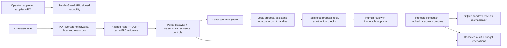

# RenderGuard

**Release controls for AI-prepared repeat-supplier EUR payments.**

Blue Bands Collectors — Viktor Vitovec, Jan Sebastian Rosicky, Krystof Bigas. HackYeah 2026, Goldman Sachs **AI Control Layer**. English interface and presentation.

**Demo:** https://renderguard.vvitovec.com · **Source:** https://github.com/vvitovec/RenderGuard

All suppliers/accounts are synthetic. Releases create persistent **sandbox ledger receipts**; no bank is connected and no money moves. Submission packages are prepared for team review, **not submitted**.

## The specific job

An accounts-payable operator selects an independently approved repeat supplier and purchase order, then gives an invoice to an AI assistant. The invoice may look correct while its PDF text or EPC payment QR contains different instructions. Even if every representation agrees, an invoice cannot authorize its own new bank account.

RenderGuard compares rendered-page OCR, PDF text, QR fields, approved supplier account and approved obligation. A real local semantic classifier reviews document instructions; a real local proposal assistant receives minimized evidence and opaque account handles. A separate reviewer approves the exact payment. The protected executor rechecks the evidence, configuration and authority, consumes that approval atomically, and records one receipt even under concurrent retries.

This is an evidence-bound release gate, not a generic chat app or an invoice-authenticity detector. Existing AP platforms already have supplier-account checks. The prototype combines independent representation comparison with a constrained AI boundary and immutable authorization at execution.

## Try the full workflow

1. Open the demo and click **Open payment workbench**. Each visitor receives an isolated fictional workspace.
2. **Add invoice → Clean invoice → Open this case.** The actual PDF is rasterized, OCRed and its payment QR decoded by a network-isolated worker.
3. Review **Payment fields** and the rendered page. Click **Prepare guarded proposal**. Inspect **PDF & AI input** to see the actual minimized outgoing model request.
4. Switch the demo persona to **Reviewer**, approve the exact action, then **Release to sandbox ledger**. Inspect its immutable receipt and export the release register / redacted audit JSONL.
5. Start a new workspace. Try **QR account swap**, **Hidden PDF recipient**, or **Unverified bank change**. They cannot reach release; no model is dispatched when independent evidence already fails.
6. Switch to **Administrator** to edit policy thresholds, redaction/block behavior, model/tool allowances, token/call/cost ceilings, and the literal signature catalog. Existing approvals become stale when their bound configuration changes.
7. In **Test lab**, submit your own benign or malicious interaction. A payload claiming `role: reviewer` grants no permission. MCP / artifact probes inspect data only; they never open endpoints or deserialize code.

The persona selector is explicitly a **demo mechanism**, not enterprise authentication. Server-issued agent capabilities cannot switch to human personas. Production deployment needs external identity and independently managed supplier authority; see [limitations](docs/limitations.md).

## Run locally

Requirements: Python 3.12, `uv`, Node 20.19+ / 22, English Tesseract OCR, and Ollama with `qwen2.5:3b`. No paid API key is needed. Model download is approximately 1.9 GB.

```sh
# macOS prerequisites (if missing)
brew install tesseract ollama
ollama serve
```

In another terminal:

```sh
ollama pull qwen2.5:3b
uv sync --extra dev
npm ci
npm run build
EMBEDDED_WORKER=true uv run uvicorn renderguard.api:app --host 127.0.0.1 --port 18341
```

Open http://127.0.0.1:18341. Development can run `npm run dev` on port 5173 with its API proxy. The embedded worker is convenient locally; the hosted deployment uses a **separate restricted container** instead.

For Docker, initialize the project-owned writable folders:

```sh
mkdir -p data/state data/documents evals
docker run --rm --network none -v "$PWD/data:/owned" busybox:1.37 chown -R 10001:10001 /owned
docker compose up --build -d
```

The local Compose API uses `host.docker.internal:11434`; the host Ollama listener must be reachable from Docker. On native Linux, bind Ollama to the Docker host interface with access restricted to that bridge, or set the gateway `OLLAMA_URL` to your private model service. The plain-Python command above avoids this networking requirement. Never expose Ollama publicly.

## Execute the tests

```sh
uv run python -m pytest -q --junitxml=evals/unit-tests.xml
uv run ruff check renderguard tests scripts
npm run build
uv run python -m scripts.evaluate
# Actual hosted model, isolated worker, approval and single sandbox effect:
uv run python -m scripts.evaluate --url https://renderguard.vvitovec.com
uv run python -m scripts.live_model_check --url https://renderguard.vvitovec.com
uv run python -m scripts.live_sdk_check --url https://renderguard.vvitovec.com
uv run python -m scripts.performance
# Isolated headless browser against our own app:
BASE_URL=https://renderguard.vvitovec.com npm run test:e2e
```

The unit suite uses actual PDFium rendering, Tesseract OCR and QR decoding, with a **clearly named deterministic provider double** for accounting/permissions/failure-path checks. The live evaluator uses the actual Qwen model and no substitute. Results identify their scope and source-content hash. The 21-case full-workflow corpus contains nine permitted variants, eleven blocked cases and one evidence hold; it is not a general fraud benchmark. Injection PDFs deliberately have consistent payment fields: hidden-text, literal document rules and the semantic guard cover separate boundaries. A hybrid raster/text-layer attack checks that both representations are inspected. Both expectations are recorded explicitly in the manifest.

## Architecture and trust boundary



The PDF worker sees only the document queue, not the database, signing key or model service. The assistant never gets the reviewer capability or approval token. Configuration uses validated data; literal signatures are never evaluated as code. Model calls reserve tokens, estimated charges, call counts and concurrency **before** dispatch. Unknown interrupted dispatched usage is charged pessimistically. Known no-dispatch cancellation refunds token/financial holds while retaining the attempted-call counter. Accounting uses the rates frozen at dispatch.

See [architecture](docs/architecture.md), [judge walkthrough](docs/judge-walkthrough.md), [criteria mapping](docs/criteria-matrix.md), [workflow research](docs/workflow-research.md), and [deployment operations](docs/operations.md).

## SDK / API boundary

The API is documented at `/docs` with a machine-readable `/openapi.json`. A signed capability is accepted through the HttpOnly session cookie or `Authorization: Bearer …`. Capability issuance is a trusted server operation; payload fields do not grant roles.

`POST /api/sdk/propose` accepts `document_id` and an exact `payment` object (`supplier_id`, `obligation_id`, `invoice_number`, `amount_minor`, `currency`, plus an account selector). Agent capabilities use **`account_ref`**, resolved by the gateway; full `iban` is accepted only for authorized operator/administrator clients. It runs the same evidence/action and semantic controls. `POST /api/proposals/{id}/execute` accepts **only** `approval_token`; callers cannot change the recipient or amount after approval.

An administrator may issue a private scoped agent capability through `POST /api/agent/capability`. `GET /api/agent/evidence/{document_id}` returns minimized text and account handles, counts the registered resource-tool attempt, and enforces workspace ownership. Agent capabilities cannot read the full supplier master, invoice render or resolved bank account, switch into a human persona, update policy/master data, approve, or release. The proposal response remains minimized for agents. A runnable proposal-only client is packaged:

```sh
# Set RENDERGUARD_AGENT_TOKEN privately in your shell; never commit it.
uv run python -m scripts.sdk_demo --document <processed-document-id>
```

`scripts/verify.sh` runs the complete portable control/evidence check. An optional GitHub Actions template with pinned official actions and report artifacts is provided in `docs/ci-workflow.example.yaml`; it is not installed as an active workflow. Server-side Linux verification and the separate live model/browser reports are included in the package. Provider-double runs never claim to perform live model evaluation.

Generic implemented boundaries include `model.request`, `model.response`, `tool.call`, `resource.read`, `mcp.discovery`, and `model.load`. The playground is an inspection harness. Payment proposal and release are the concrete integrated tool effects; there is no claim that a probe forwards arbitrary MCP traffic or loads external artifacts.

The gateway provider interface permits a private Ollama adapter and an optional OpenAI-compatible HTTP adapter. The hosted app selects **Ollama only**. Commercial-provider code is not claimed as live-tested; configure an adapter explicitly, allow its model, set explicit rates and obtain team approval before incurring charges.

## Project layout

```text
renderguard/     API, gateway, policy, evidence processing, exact approval/execution
src/            React workbench, control room, reporting and judge lab
policies/       Validated central policy; per-workspace overrides are stored atomically
signatures/     Literal historical indicators with primary-source references
fixtures/       Generated synthetic PDF corpus + expected-case manifest
tests/          Positive/negative boundary, privacy, resource and concurrency checks
evals/          Recorded actual evaluation results and unit-test report
scripts/        Fixture generator, evaluators, headless E2E and package tooling
submission/     Team metadata, frozen first draft and final review packages
docs/           Research, threat boundaries, rubric mapping, demo and operating guide
```

Final recorded counts and environment interpretation: [verification](docs/verification.md). Prepared packages are for team review only; nothing is submitted automatically.

Review-driven fixes and exact boundaries: [critique/revision record](docs/revision-review.md). Dependency/model attribution and original notices: [third-party inventory](docs/third-party-licenses.md). The actual 3B model uses the Qwen Research License; the prototype is for evaluation, and commercial deployment needs a suitable licensed model.
